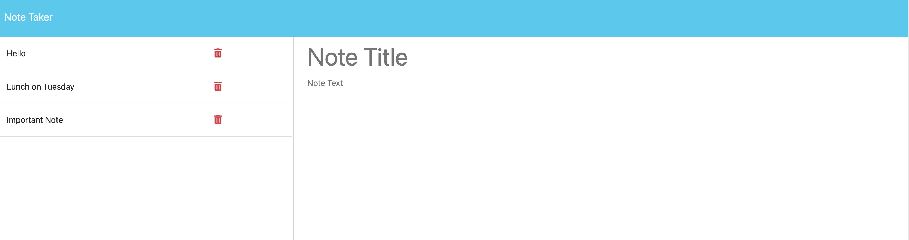
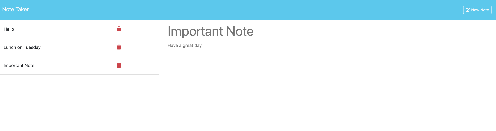
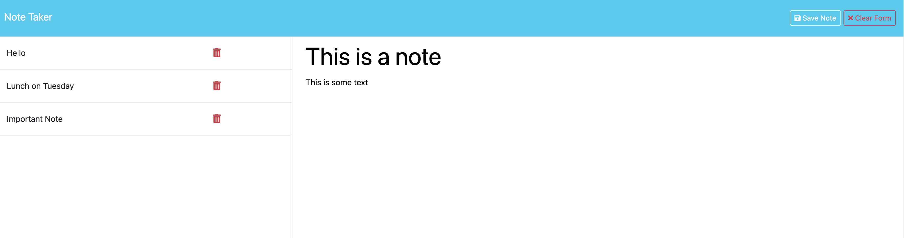

# Note Taker Application

## Description

The following project was created as a part of the Adealide University Web Development Bootcamp. This purpose of this project has been to utilise the Express.js framework to build a web application and its associated APIs. By creating a Note Taking application I was able to explore GET, POST and DELETE requests and methods. This project could be useful for someone looking for a simple note taking application where they can write, save, view and delete notes with a heading and a text.

While completing this project I gained valuable skills in using the Express.js framework by making GET, POST and DELETE requests which were used to display, write and delete notes to a JSON file located on the server. I found that through compelting this project, I understood the importance of separating the front and back end along with how to commmunicate information between the two frameworks. It has been helpful to gain insight into the function of middleware, the Node File System and paths.

Access the live link for this application here: https://my-note-taker-app-for-uadl-a461885ba86d.herokuapp.com/
This application has been deployed with heroku
## Usage
Access this application by using the deployed heroku application here: https://my-note-taker-app-for-uadl-a461885ba86d.herokuapp.com/
After accessing the live server you can load the Notes section by pressing "Get Started"

Once in the Notes section you will presented with some example notes and a blank view of a note.

By Clicking on a note in the left sidebar you will load the note into the viewing area.

If you select New Note in the top right corner you will again be presented with the blank view screen. 
Fill out a note heading and some text to allow saving of the note.

Click the Bin icon next to your list of notes to delete a note. 

